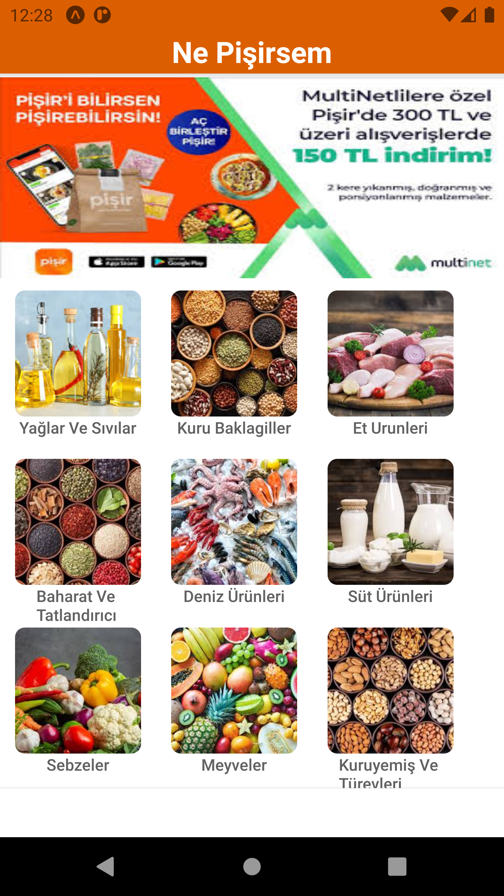
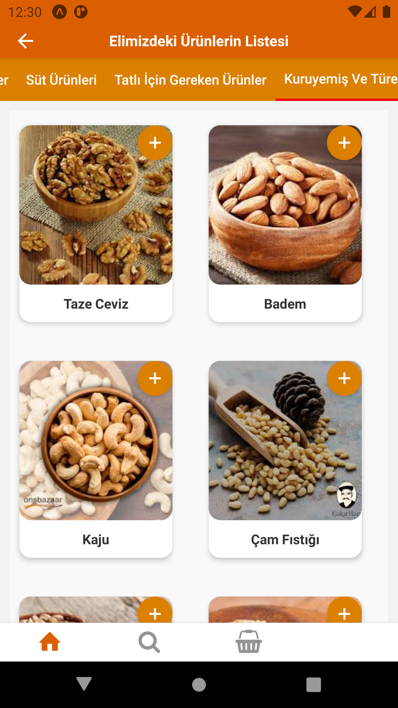
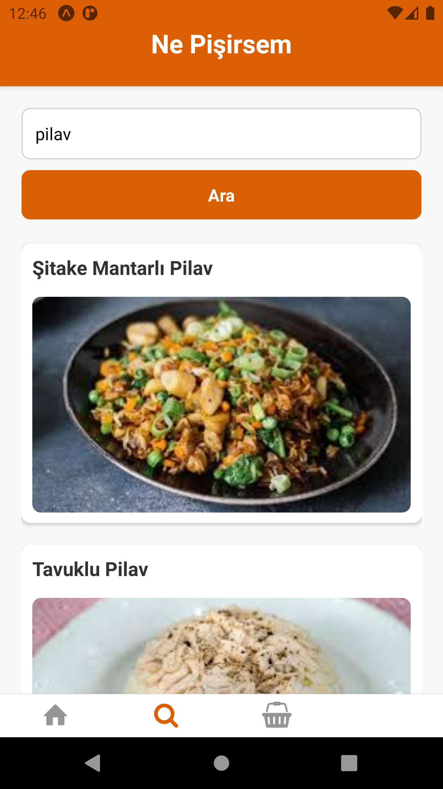
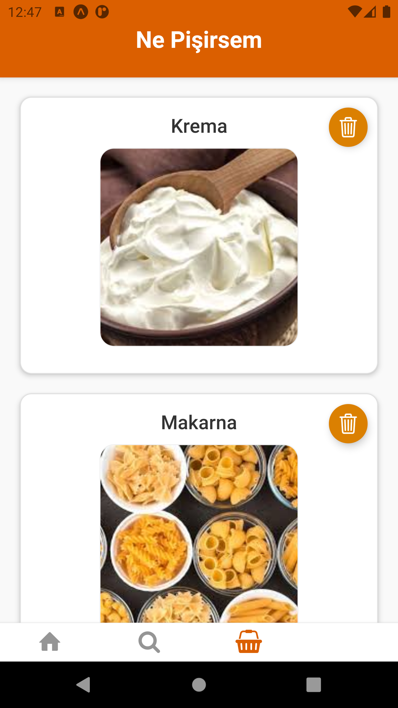
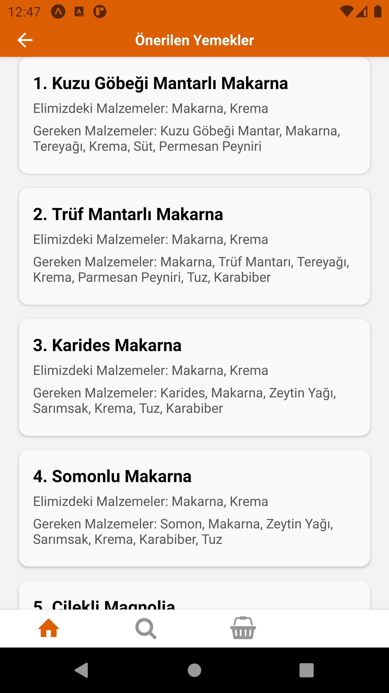

# 🍽️ Ne Pişirsem – AI-Assisted Recipe Suggestion App

**Ne Pişirsem**, evde bulunan malzemelere göre kullanıcıya yemek tarifi önerileri sunan bir mobil uygulamadır. React Native ve Firebase Firestore kullanılarak geliştirilmiştir. Uygulama, kullanıcıdan aldığı girişlerle veritabanındaki tarifleri eşleştirerek en uygun yemekleri listeler.

---

## 🚀 Özellikler

- 📋 Malzeme girişine göre tarif filtreleme
- 🔍 Firestore üzerinden hızlı ve gerçek zamanlı veri çekme
- ⚡ Performans odaklı sade arayüz
- 📱 Mobil uyumlu ve TypeScript destekli React Native kod yapısı

---

## 🛠️ Kullanılan Teknolojiler

- **React Native** – Mobil uygulama geliştirme
- **TypeScript** – Tip güvenli JS kod yapısı
- **Firebase Firestore** – Gerçek zamanlı NoSQL veritabanı
- **Expo CLI** – Mobil uygulamayı test ve geliştirme aracı

---
### Ana Sayfa

### Ürünler Lİstesi


### Arama  Ekranı

### Sepet  Ekranı

### Önerilen Yemekler  Ekranı

### Yemek Tarifi  Ekranı

## 🧩 Kurulum

```bash
git clone https://github.com/Furkan-Ozbayrak/ne-pisirsem.git
cd ne-pisirsem/NePisirsem
npm install
npx expo start


