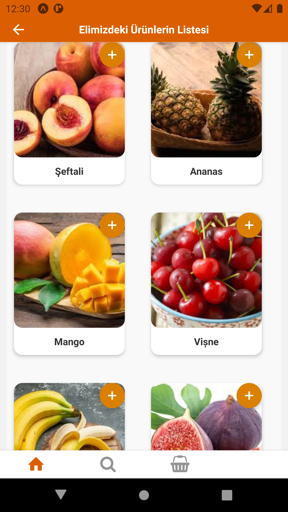
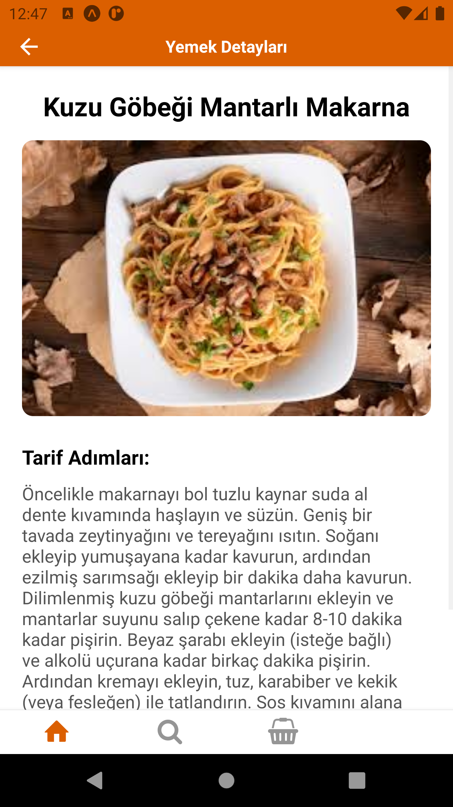

# 🍽️ Ne Pişirsem – AI-Assisted Recipe Suggestion App

**Ne Pişirsem**, evde bulunan malzemelere göre kullanıcıya yemek tarifi önerileri sunan bir mobil uygulamadır. React Native ve Firebase Firestore kullanılarak geliştirilmiştir. Uygulama, kullanıcıdan aldığı girişlerle veritabanındaki tarifleri eşleştirerek en uygun yemekleri listeler.

---

## 🚀 Özellikler

- 📋 Malzeme girişine göre tarif filtreleme  
- 🔍 Firestore üzerinden hızlı ve gerçek zamanlı veri çekme  
- ⚡ Performans odaklı sade arayüz  
- 📱 Mobil uyumlu ve TypeScript destekli React Native kod yapısı  

---

## 🛠️ Kullanılan Teknolojiler

- **React Native** – Mobil uygulama geliştirme  
- **TypeScript** – Tip güvenli JS kod yapısı  
- **Firebase Firestore** – Gerçek zamanlı NoSQL veritabanı  
- **Expo CLI** – Mobil uygulamayı test ve geliştirme aracı  

---

## 📸 Uygulama Ekran Görüntüleri

<h4>🏠 Ana Sayfa</h4>


<h4>🛒 Ürün Listesi</h4>



<h4>🔍 Arama Ekranı</h4>


<h4>🛍️ Sepet Ekranı</h4>


<h4>🍽️ Önerilen Yemekler</h4>


<h4>📋 Yemek Tarifi Detayı</h4>


---

## 🧩 Kurulum

```bash
git clone https://github.com/Furkan-Ozbayrak/ne-pisirsem.git
cd ne-pisirsem/NePisirsem
npm install
npx expo start
